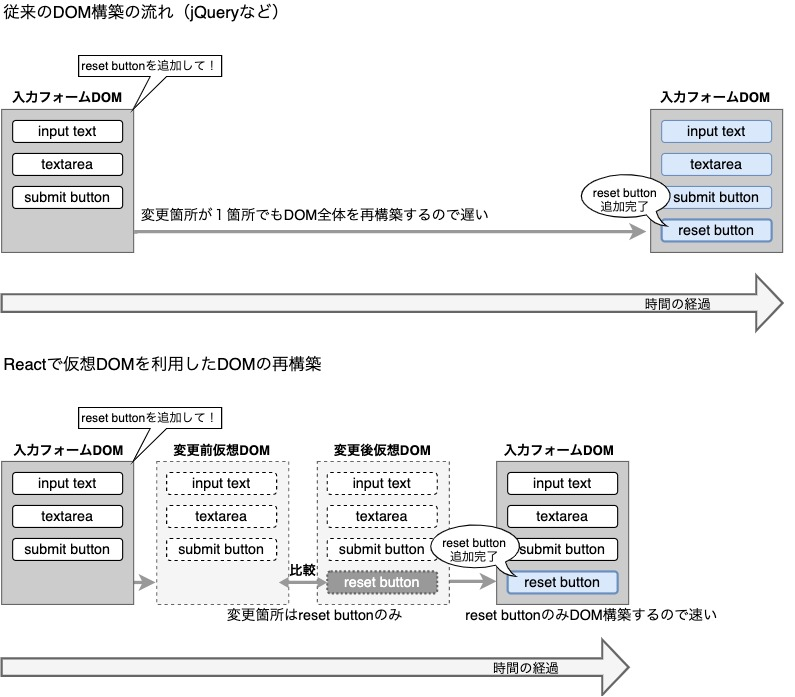

# DOMとは
Webページとスクリプトやプログラミング言語を接続するものである。これにより、
要素の値をダイレクトに操作可能。

## リアルDOM
従来までは、javascriptなどで出力した処理から、WebページのDOMを生成する際、DOM全体を再生成していた。

## 仮想DOM
仮想DOMでは、WebページのDOMをすぐに生成するのではなく、まず仮想的なDOMを生成し、構築された仮想DOMの内容を基にHTMLを作成し、実際のWebページのDOMとの差分のみDOMに追加されます。

